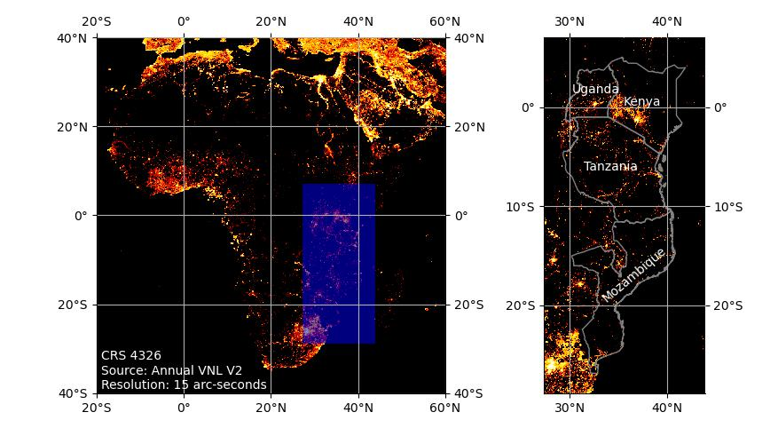

# Han's manual script

## Prepare Data from source
All processed data is in `data.xlsx`, if you want to prepare data from source, you need download some data to run the Jupyter notebooks `prepare.ipynb`.

|Variable name| Explanation            | Data source | Preprocessing |
|-------------|------------------------|---|---|
| GDP         | Gross domestic product | [WDI][] [Kenya GCP][] [National Accounts of Tanzania Mainland][] [Quadros PIB provincial][] | Calibrate all subnational GDP to international dollar by scale factor |
| POP         | Population             | Census data from corresponding country's bureau of statistics [WorldPop] | Interpolate missing with WorldPop data|
| NTL         | Nighttime Lights sum   | [VNL v2](https://payneinstitute.mines.edu/eog/nighttime-lights/)| Clip and sum values for each region `np.sum(clipped)` |
| logNTL      | Nighttime Lights log sum| same as above| Clip and sum values for each region `np.sum(np.log1p(clipped))` |
| NTLc        | Nighttime Lights counts | same as above| Count of pixel where NTL greater than 0 `np.count(clipped > 0)` |
|AREA| Region area |[GADM][] [Uganda Districts Shapefiles 2020][]|Calculate by GeoPandas `gdf.geometry.to_crs("epsg:3857").area`|

Thanks for "Excel for Microsoft 365 for Mac" feature "Insert data from picture", data in PDF-format reports are extracted.

[WDI]: https://databank.worldbank.org/reports.aspx?source=World-Development-Indicators
[WBPAPI]: https://blogs.worldbank.org/opendata/introducing-wbgapi-new-python-package-accessing-world-bank-data
[GADM]: https://gadm.org
[pygadm]: https://github.com/12rambau/pygadm
[Uganda Districts Shapefiles 2020]: https://data.unhcr.org/en/documents/details/83043
[Uganda Census]: https://www.ubos.org
[Kenya GCP]: https://www.knbs.or.ke/download/gross-county-product-gcp-2021/
[2]: https://www.ubos.org/wp-content/uploads/statistics/Census_Population_counts_(2002_and_2014)_by_Region,_District_and_Mid-Year_Population_projections_(2015-2021).xlsx
[National Accounts of Tanzania Mainland]: https://www.nbs.go.tz/nbs/takwimu/na/National_Accounts_of_Mainland_Tanzania_2020.zip
[Quadros PIB provincial]: http://www.ine.gov.mz/estatisticas/estatisticas-economicas/contas-nacionais/anuais-1/quadros_pib-provincial-2011-2020-final.pdf/at_download/file
[WorldPop]: https://www.worldpop.org